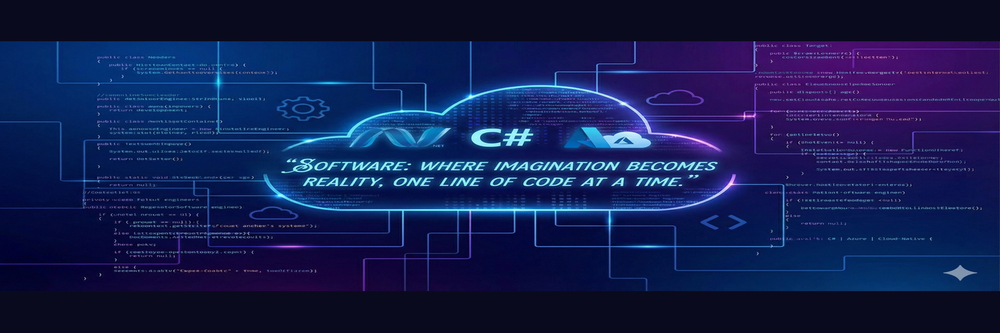

<!--
**AsmaaYassinDev/asmaayassindev** is a ✨ _special_ ✨ repository because its `README.md` appears on your GitHub profile.
-->

<!-- GitHub Header Image -->

# Hi, I’m Asmaa Ibrahim Yassin 👋
Software Engineer with 9+ years of experience in **C#, SQL Server, ASP.NET Core, Angular, and TypeScript**.  
Experienced in developing software solutions tailored to meet organizational needs.

📍 England  
📧 asmaaibrahim2014@gmail.com  
📱 +44 7392 174895  
[LinkedIn](https://www.linkedin.com/in/asmaayassin) | [GitHub](https://github.com/AsmaaYassinDev)

---

## 💻 Skills & Tech Stack

**Proficient:**  
C#, ASP.Net Core, ASP.NET MVC, ASP.NET Web API, Entity Framework, SQL Server, Angular, TypeScript, Moq, xUnit, Git, Scrum  

**Familiar:**  
Azure, Python, Windows Forms, WPF, Java, ReactJS, PostgreSQL, Docker, TFS, jQuery, HTML, JSON, Design Patterns, SOLID, MongoDB  

---

## 🛠 Work Experience

**Volunteer Coding Instructor** – CodeYourFuture, Birmingham, UK | Sep 2025 – Present  
- Teaching coding and web development to learners, mentoring, and helping build career-ready skills.

**.NET Full Stack Software Engineer** – Abu Dhabi Ports Group, Abu Dhabi, UAE | Mar 2023 – Jan 2025  
- Developed web applications using .NET & Angular. Created logistics projects and resolved software issues.

**Senior Software Engineer** – FlairsTech, Remote, Egypt | Oct 2021 – Feb 2023  
- Maintained marketing automation solutions and developed web apps for clients in the US & UK.  

**Senior Software Engineer** – Giza Systems, Cairo, Egypt | Sep 2019 – Sep 2021  
- Developed enterprise business solutions, APIs, smart city IoT systems, and mentored junior developers.

**Senior Full Stack .NET Developer** – International Turnkey Systems, Cairo, Egypt | Feb 2018 – Aug 2019  
- Worked on online banking solutions, managed a small team, and implemented financial services platforms.

**Software Engineer** – Global Impact, Alexandria, Egypt | Sep 2015 – Jan 2018  
- Developed software solutions, data APIs, and web-based systems for clients in different industries.

---

## 🎓 Education

- **MSc Computer Science & Technology with Business Development** – Ulster University, Birmingham, UK | Jan 2025 – Feb 2026  
- **Software Development Diploma** – ITI, Mansoura, Egypt | Oct 2012 – Jun 2013  
- **BSc Computers & Information** – Mansoura University, Egypt | Sep 2007 – Jul 2011 (Very Good)

---

## 🌱 Currently Learning
- Advanced cloud development (Azure)  
- Python for data-driven applications  

---

## 🤝 Let's Connect
- Open to collaborations on **.NET & Angular projects**  
- Feel free to reach out via email or LinkedIn

---

## ⚡ Fun Fact
- I love swimming 🏊‍♀️, traveling ✈️, smiling 😄, and meeting new people 🤝

